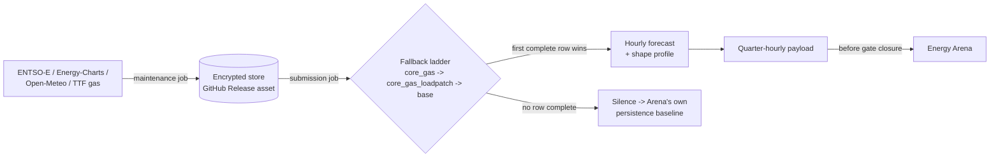

# day-ahead-forecast-live-ops

Daily, unattended day-ahead electricity price forecasting for Germany (DE-LU), submitted live and scored publicly by the [Energy Arena](https://energy-arena.org). Participant in the Energy Arena.

## What this is

A day-ahead model is easy to make look good in a backtest: the information actually available at the moment a real forecast has to be made is easy to get wrong by accident. This repository runs the forecast live, every day, against the Energy Arena's gate-closure deadline, which prospectively evaluates whatever was submitted before the deadline — not a replay with hindsight. Model development, calibration, and risk-side validation (VaR/ES backtesting, quantile reliability) live in the sibling project, [`energy-price-forecast-risk-validation`](https://github.com/soentkeblindow/energy-price-forecast-risk-validation); this repository is the production pipeline built on top of it: live data, a fallback ladder for when an input is late or missing, and the submission itself.

## Current status

<!-- OWNER: fill in before publishing — current rank, RMSE, and window from
     https://energy-arena.org's Point Forecast DE-LU leaderboard, e.g.
     "Rank 8, RMSE 33.9 EUR/MWh (last 7 days), as of 2026-10-06." These
     numbers move daily; after 1-2 weeks on a rolling leaderboard they are
     not yet statistically stable — read them as a status check, not a
     result. -->

## How it works

A maintenance job syncs raw inputs (ENTSO-E, Energy-Charts, Open-Meteo weather, TTF gas) into a single encrypted archive, published as a GitHub Release asset and re-downloaded fresh by every run — never committed to git, never cached in Actions. A submission job reads that store, builds the day's feature row, and tries three candidate models in rank order, the first one with a complete input row wins. The winning hourly forecast is expanded to the Arena's native quarter-hourly resolution with an additive intra-hour shape profile, validated, and posted before the Arena's gate closure. An external scheduler (a Cloudflare Worker, not GitHub's own `schedule:` trigger — see [Known limitations](#known-limitations)) drives both jobs at fixed local times.



## The information-set problem

The Arena's day-ahead auction closes at 12:00 local time, but the TSOs' own wind/solar forecasts (ENTSO-E 14.1.D) aren't published until roughly 18:00 the day before — after the deadline that matters. Many backtests use these series as features anyway, which quietly assumes information a live system never actually has (a point the [platform paper](#citation) itself raises). This pipeline instead reconstructs wind, solar, and residual load from ECMWF weather model data (a fixed 00-UTC run, read out at the lead times actually available before gate closure), at a measured cost of about 1.3 EUR/MWh RMSE against an upper-bound model trained on the real TSO forecasts.

## Fallback ladder

Three independently-measured candidates, tried in rank order; the first one whose inputs are actually complete for the day wins ([measurement source](outputs/results/measurement_a_candidate_intake_summary.csv), [Similar-Day-Patch re-measurement](outputs/results/measurement_e_load_forecast_reconstruction_summary.csv)):

| Rank | Row | Reads | Load source | Measured RMSE (EUR/MWh) |
|---|---|---|---|---|
| 1 | `core_gas` | calendar, NWP residual-load reconstruction, price lags, TTF gas | ENTSO-E day-ahead load forecast | 28.97 |
| 2 | `core_gas_loadpatch` | identical model and training to rank 1 | Similar-Day-Patch (same weekday, last week or last available Sunday) | 29.01 |
| 3 | `base` | calendar, price lags only — no gas, no weather reconstruction | — | 38.39 |
| — | silence | — | — | Arena persistence baseline, 45.27 |

Rank 2 is not a second model — [`tests/test_candidates.py::test_rows_1_and_2_share_the_exact_same_groups`](tests/test_candidates.py) pins that it's rank 1's own model and training, with only the target day's own load-forecast cell replaced. Rank 3 is deliberately gas-free, so a dead commodity feed degrades the forecast instead of silencing it. A later, worse-ranked submission may never overwrite an already-accepted better one for the same day (downgrade protection). The ten decisions behind this design (why a ladder instead of one model, why the floor row is gas-free, why Energy-Charts is a price mirror and not a second candidate, and others) are in [`documentation/decisions.md`](documentation/decisions.md).

## Tests worth reading

Roughly 1,050 tests exist; the count itself isn't the point. These are the ones worth opening directly:

- [`tests/test_feature_integration.py::test_dst_days_correct_row_count_and_single_run_init`](tests/test_feature_integration.py) — a DST transition day (92 or 100 quarter-hours instead of 96) builds the right row count from a single weather run, not two.
- [`tests/test_feature_integration.py::test_leakage_negative_control_run_from_target_day_itself_is_caught`](tests/test_feature_integration.py) — a leakage check that has never actually been run red is a claim, not a proof; this deliberately feeds it a same-day weather run and confirms it fails loudly.
- [`tests/test_feature_integration.py::test_no_da_forecast_renewables_column_in_live_feature_set`](tests/test_feature_integration.py) — asserts the live feature set contains none of the TSO forecast columns that aren't actually available at gate closure, with a negative control proving the check isn't vacuous.
- [`tests/test_workflow_script_entrypoints.py`](tests/test_workflow_script_entrypoints.py) — loads every script a GitHub Actions workflow invokes under that invocation's *real* `sys.path` shape, not the shape pytest's own import machinery provides. A version of exactly this gap once cost a full live delivery day (`ModuleNotFoundError` in production, invisible to the existing test suite); this test's own negative control proves it would have caught that incident.
- [`tests/test_candidates.py::test_rows_1_and_2_share_the_exact_same_groups`](tests/test_candidates.py) — pins that the fallback ladder's rank 2 is rank 1's own model, not a second one trained separately.

## Known limitations

- **Hourly model plus a shape profile, not a native quarter-hourly model.** The bridge architecture measurably beats both the Arena baseline and a flat (non-shaped) expansion, but a model trained natively on quarter-hourly data is future work, not this repository.
- **GitHub Actions' own `schedule:` trigger proved unreliable enough in measured practice — delays well past the Arena's gate closure, not an occasional edge case — that an external Cloudflare Worker drives the daily jobs instead.**
- **The quantile/probabilistic track (WIS) is not live.** Only the point-forecast (RMSE) track is currently submitted.
- Several candidate-ladder limits (a multi-week Similar-Day-Patch escalation, a combined training-window-plus-patch outage) are deliberately left unmeasured — the margin to the next fallback row is wide enough that measuring them has low value for the cost of building the measurement.

## Data sources and licensing

- **ENTSO-E Transparency Platform** — day-ahead prices, load, generation, cross-border flows. Public, free self-service registration.
- **Open-Meteo** (ECMWF IFS) — weather model data for the renewables reconstruction, CC BY 4.0.
- **Energy-Charts** (Fraunhofer ISE) — installed-capacity registry and a price/load mirror, CC BY 4.0.
- **Yahoo Finance** (TTF gas) — a paid-exchange-derived series that may not be redistributed under Yahoo's terms. This is the reason the data store is encrypted end to end: code and every other data source here are public, this one series is not redistributable, so the whole store is encrypted rather than carving out one column.
- **Submission payloads are committed at submission time** and are therefore visible before gate closure. This is deliberate: the full pipeline and every other data source here are already public, so a motivated reader could reconstruct the forecast anyway.

## Citation

If you reference the Energy Arena platform itself, its maintainers ask for this citation:

```
Kleinebrahm, M., Berrisch, J., Eiser, P., et al. (2026).
Energy-Arena: A Dynamic Benchmark for Operational Energy Forecasting.
arXiv:2604.24705. https://arxiv.org/abs/2604.24705
```

```bibtex
@misc{kleinebrahm2026energyarena,
  title  = {Energy-Arena: A Dynamic Benchmark for Operational Energy Forecasting},
  author = {Kleinebrahm, Max and Berrisch, Jonathan and Eiser, Philipp and others},
  year   = {2026},
  eprint = {2604.24705},
  archivePrefix = {arXiv}
}
```

## Reproducing / running it

Needs four secrets (see [`.env.example`](.env.example) for exact names and generation commands): `ENTSOE_API_KEY`, `ARENA_API_KEY` + `ARENA_API_BASE_URL`, and `STORE_ENCRYPTION_KEY` (generate with `uv run python -c "from cryptography.fernet import Fernet; print(Fernet.generate_key().decode())"`).

```
uv sync --all-extras --dev
GITHUB_TOKEN=$(gh auth token) uv run python -m scripts.outage_drill --scenario none
```

This runs the real submission pipeline against a copy of the published store with `live=False` — it builds and validates a payload but never posts it. If the encryption key is ever lost, `scripts/rebuild_store.py` rebuilds the entire store from source instead of decrypting the existing archive.

## Provenance

This repository started as a byte-for-byte copy of `energy-price-forecast-risk-validation`'s validated model (same package name on purpose, to keep that diff possible), then built the live pipeline around it. Four checks proved the copy was exact before anything else was built on top of it: a file-hash diff of every copied file, the source repo's own test suite passing unchanged, a bit-identical match against a frozen golden fixture ([`tests/test_provenance.py`](tests/test_provenance.py)), and a full production backtest reproducing the source repository's own documented headline MAE. Three scoped, individually-justified exceptions to byte-identity exist since then (an added timeout, an additive caching parameter, and a VWAP weight-fallback fix) — none of them change behavior for any caller that doesn't opt in. Full detail: [`documentation/decisions.md`](documentation/decisions.md).
